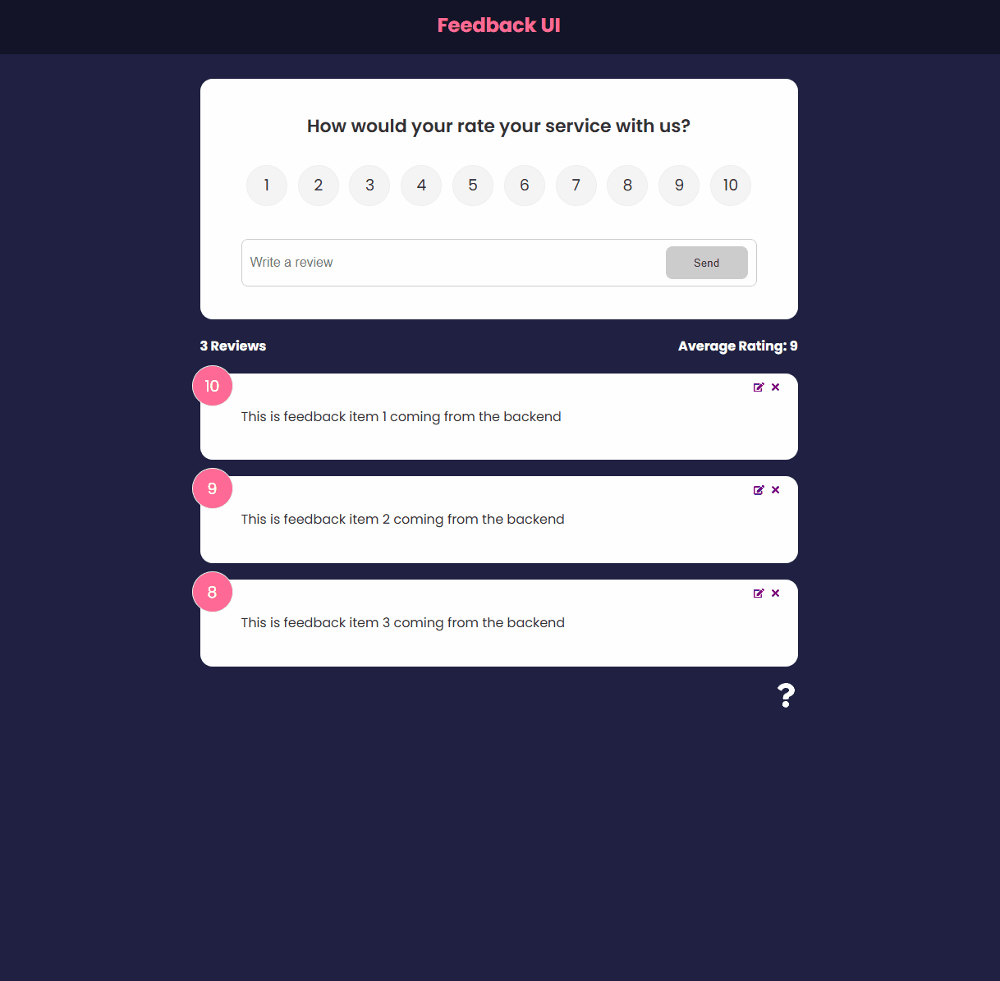

# Feedback UI

A modern and interactive feedback app built with **React**, powered by **Vite**, and supported by a mock backend using **JSON Server**. Users can submit their service ratings, leave reviews, edit or delete them, and view the average rating dynamically.



## 🚀 Features

- ⭐ Rate the service (1 to 10)
- ✍️ Submit, edit, or delete reviews
- 📊 Live average rating calculation
- 💻 Backend simulated using `json-server`
- 🎨 Smooth animations with `Framer Motion`
- 🔁 Routing support with `react-router-dom`

## 🛠️ Technologies

- React 19
- Vite
- React Router DOM
- JSON Server
- Framer Motion
- React Icons

## 📦 Installation

1. **Clone the repo**

   ```bash
   git clone https://github.com/KeskenRidvan/01-feedback-app.git
   cd 01-feedback-app
   ```

2. **Install dependencies**

   ```bash
   npm install
   ```

3. **Start the mock backend**

   ```bash
   npm run server
   ```

4. **Start the development server**
   ```bash
   npm run dev
   ```

The mock backend will be running on http://localhost:5000 and the React app on http://localhost:5173.
